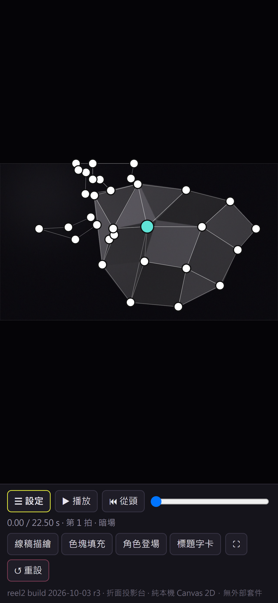
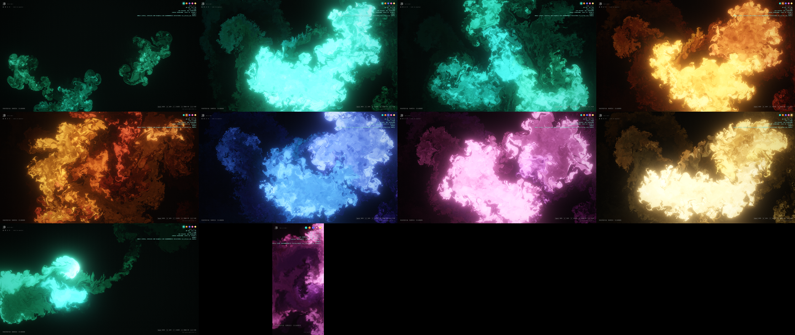
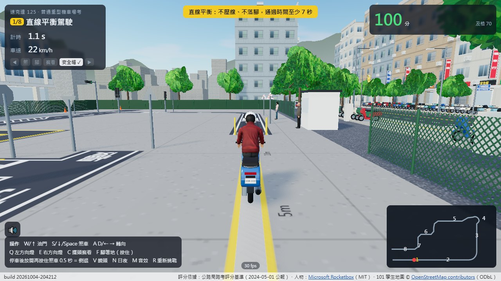

# Cc web toys

幾個純瀏覽器的互動作品，都是和 Claude Code 一起做的。手機也能玩。

| 作品 | 是什麼 | 怎麼開 |
|---|---|---|
| 折面投影台 [`facetstage/`](facetstage/) | 投影映射（projection mapping）工具：把霓虹線稿、閃電色塊、角色和標題，依節拍「貼」到立體牆的每一個面上 | 雙擊 `index.html` |
| 滲 nijimi [`nijimi/`](nijimi/) | 互動流體：手指或滑鼠劃過，發光的墨水就在水裡暈開、捲起渦流 | 雙擊 `index.html` |
| 台灣機車考照 [`moto-exam/`](moto-exam/) | 3D 機車路考：照官方場地與評分基準的 8 關考場，蓋在 OpenStreetMap 重建的台北 101 街區裡 | 靜態伺服器或 GitHub Pages（見下） |

| 折面投影台 | 滲 nijimi | 台灣機車考照 |
|---|---|---|
|  |  |  |

### 線上試玩（GitHub Pages）

到 repo 的 Settings → Pages，Source 選 `Deploy from a branch`、Branch 選 `main` 與 `/ (root)`，之後各作品的網址是
`https://<帳號>.github.io/Cc-web-toys/<資料夾>/`，例如 `.../moto-exam/`。全部是靜態檔案，不需要建置。

本機要跑 `moto-exam/` 的話，在該資料夾執行 `python -m http.server 8000`（或 `npx serve .`）再開 http://localhost:8000/ ；它用 ES module 與 `fetch` 載入模型，直接雙擊 `index.html` 會被瀏覽器擋下。

## 折面投影台

打開 `facetstage/index.html`（加 `?view=sim&play` 會直接以模擬牆面模式播放）。

- **描面**：上傳一張從投影機位置拍的牆面照片，按「✦ 自動偵測面」讓程式找出牆上的平面，或用「新增面」手動描點。相鄰面共用的角會一起動，可以拖曳或用方向鍵微調。
- **內容**：每個面自動產生霓虹描邊、方格／斜線／鋸齒圖樣，以及擦入的閃電色塊；角色插畫和文字用四個角做透視貼合。預設角色是程式畫的原創角色，可換成自己的圖。
- **節拍**：段落為 暗場 → 線稿 → 填色 → 角色 → 標題 → 收尾，每段幾拍可調；BPM 可輸入或點拍子，也能載入音樂或用麥克風，讓大鼓觸發閃動。
- **上場**：「開啟投影視窗」開出第二個視窗，拖到投影機螢幕、雙擊全螢幕，播放進度與主視窗同步。
- **手機**：設定面板可收合（☰ 設定）、觸控有放大的點擊範圍、「↺ 重設」回到初始狀態。

自動偵測面在測試圖上的結果（`facetstage/shots/auto_*_d5.png`）：天花板斜樑 5/5、手風琴摺紙 7/6、低多邊形牆 11/13；低對比的牆要把細緻度調高。拍照時要關掉投影、讓燈光平均；曲面、紋理很多的牆面、強烈陰影會偵測不準。

示範影片：[`facetstage/shots/demo.mp4`](facetstage/shots/demo.mp4)

## 滲 nijimi

打開 `nijimi/index.html`。

- 移動滑鼠／手指拖曳：沿路注入墨水；點擊：一團亮核加花瓣綻放；空白鍵：多處爆發；R 清除、F 全螢幕、H 隱藏介面、1–5 換色盤（翡翠、焰、藍、櫻、金）。
- 閒置 8 秒會進入自動模式，畫面不會停住。手機支援多指同時畫。
- 網址參數：`?debug`（fps 與畫質等級）、`?q=ultra|high|medium|low|min`、`?palette=fire`、`?transparent=1`（透明背景，可疊在其他畫面上）。
- 程式介面（可接聊天室指令或音樂節拍）：`window.__ink.splat(x, y, dx, dy)`、`bloom(x, y)`、`burst(n)`、`setPalette(name)`、`clear()`。
- 在 Intel UHD 630 內顯上 1920×1080 約 60 fps，掉幀時會自動降一級畫質。

## 台灣機車考照

打開 `moto-exam/`（要用靜態伺服器，見上）。詳細說明在 [`moto-exam/README.md`](moto-exam/README.md)。

- 先選車型：速克達 125、Grom 型迷你檔車，或娛樂挑戰的電動獨輪車。
- 8 關依序：直線平衡（15 m × 40 cm，至少 7 秒）→ 斑馬線 → 交岔路口 → 二段式轉彎 → 變換車道 → 直角轉彎 → 停車再開 → 平交道。滿分 100、70 分及格，扣 32 分的項目犯一次就不及格。
- 操作：W/S 油門煞車、A/D 轉向、Q/E 方向燈、C 擺頭察看、F 腳著地、N 日夜、R 重新挑戰；手機有觸控按鈕。
- 評分依據：行政院公報第 030 卷第 080 期（2024-05-01）《普通重型及輕型機車駕駛人路考評分基準》。地圖 © OpenStreetMap contributors（ODbL）；人物模型 Microsoft Rocketbox（MIT）。這是打包好的發布版（three.js），沒有附原始碼。

## 測試工具

`facetstage/` 與 `nijimi/` 的 `tools/` 是用無頭 Chrome 截圖、驗證互動的腳本（playwright-core）：

```bash
npm i playwright-core            # 或用 PW_FROM 指向已安裝 playwright-core 的位置
node facetstage/tools/autotest.mjs      # 各測試圖、各細緻度的自動偵測截圖
node facetstage/tools/phonetest.mjs     # 手機尺寸：上傳 → 偵測 → 套用 → 拖點
python facetstage/tools/make_synth.py   # 重新產生合成測試圖
node nijimi/tools/shoot.mjs             # 各色盤、爆發、自動模式、手機觸控截圖
node nijimi/tools/tiers.mjs             # 各畫質等級的 fps 與 GPU 時間
```

需要本機安裝的 Google Chrome（腳本用 `channel: 'chrome'` 並開 GPU）。

## 授權

MIT（見 `LICENSE`）。測試圖為程式合成；截圖與示範影片為本專案自行輸出。

`moto-exam/` 內含第三方素材：OpenStreetMap 資料（ODbL）與 Microsoft Rocketbox 人物模型（MIT，見 `moto-exam/rocketbox/LICENSE-Rocketbox.md`），出處見 [`moto-exam/README.md`](moto-exam/README.md)。
