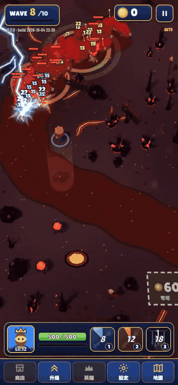
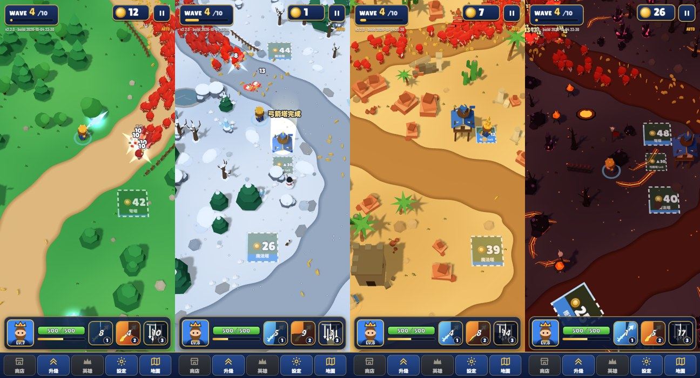
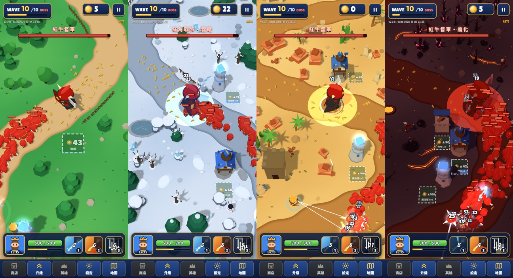
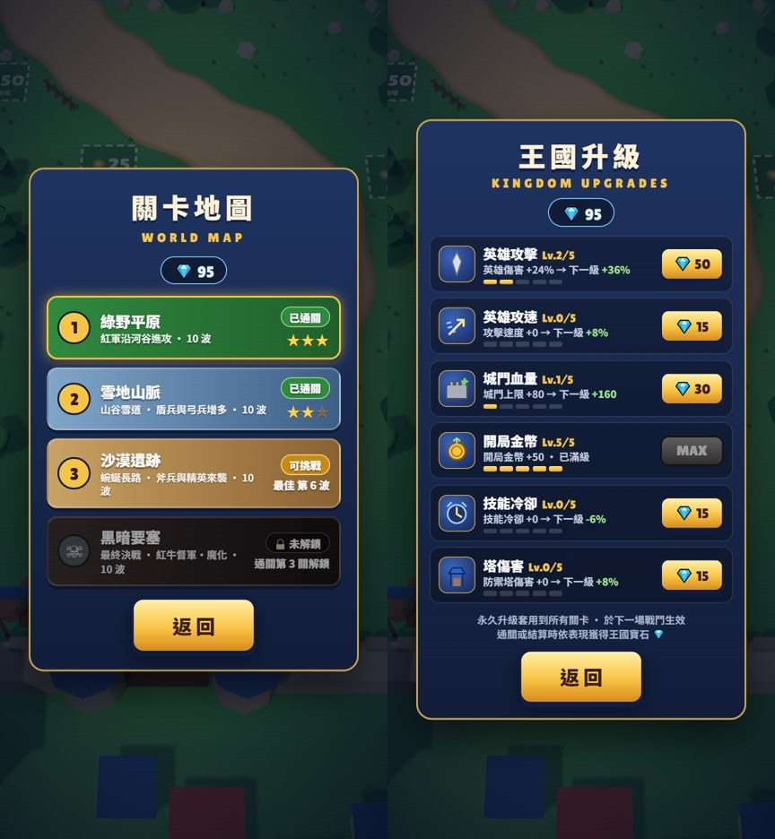
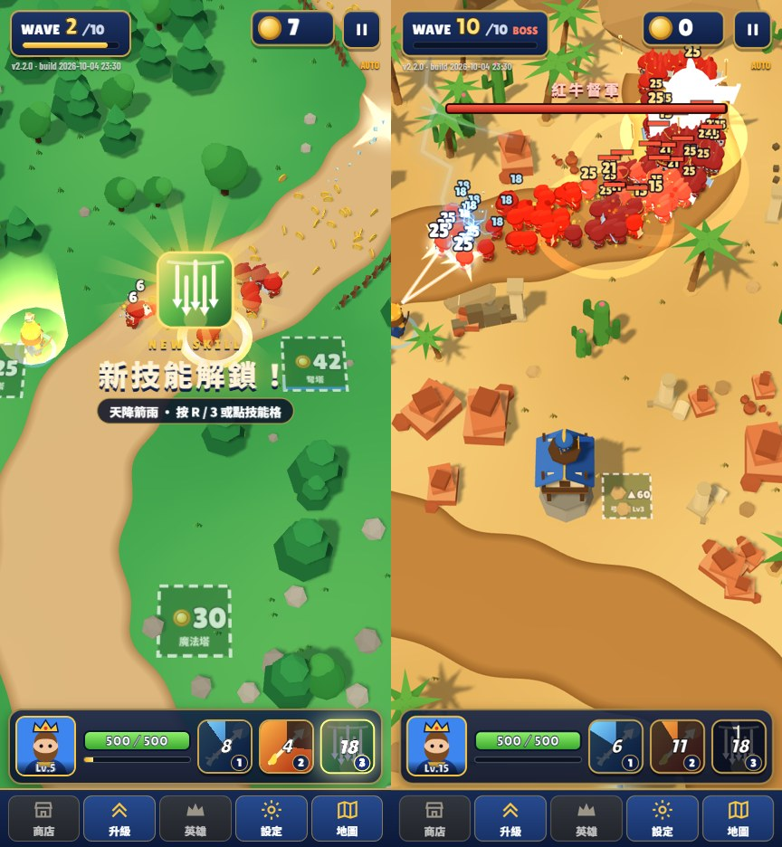
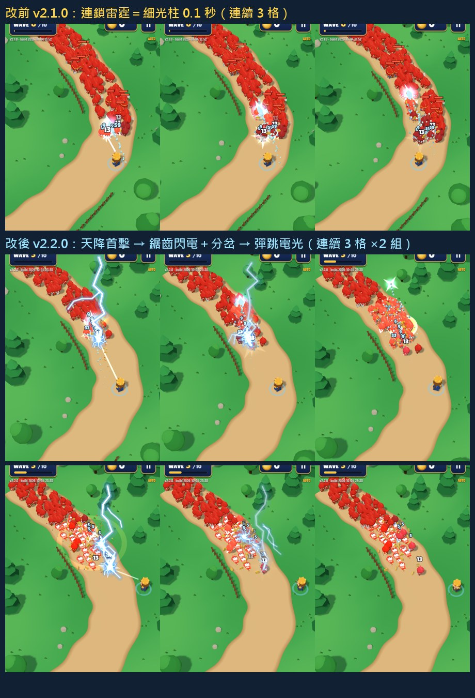

# ArrowKing 箭王之戰 `arrowking/`

**線上試玩**：<https://claude.ai/artifact/JhqDAgmEbjhKS1EeaQVRgn>（claude.ai 的 Artifact 頁面，第一次開啟可能要登入 claude.ai）
也可以 clone 下來直接雙擊 `index.html`：單一檔案，three.js 與字型從 CDN 載入，需要網路。

完整錄影（15 秒，直式）：[`media/arrowking_v2.2_15s.mp4`](media/arrowking_v2.2_15s.mp4)

## 介紹

直式手機畫面的 3D 守城塔防。紅色大軍沿著河谷一波波湧向城門，你操作英雄（弓手或騎士）在戰場上跑位，靠近敵人就自動攻擊；撿金幣、蓋防禦塔、抽強化卡，撐過 10 波再打倒 Boss 守住王國。

## 玩法

- **移動**：拖曳畫面或 WASD／方向鍵，英雄靠近敵人會自動攻擊。
- **建塔**：點價格格子（英雄會自己走過去付錢），或直接踩上去；弓箭塔、弩塔、魔法塔、拒馬，蓋好還能升級。
- **強化**：升級時三選一強化卡。
- **技能**：冰箭（穿透一整排）、火箭（轟炸敵群）、天降箭雨；英雄 Lv.5 解鎖第三技能天降箭雨。
- **四關**：綠野平原 → 雪地山脈 → 沙漠遺跡 → 黑暗要塞，每關 10 波、第 10 波是 Boss；過關依表現給一到三顆星。
- **永久升級**：通關或結算拿到王國寶石，在「王國升級」買英雄攻擊、攻速、城門血量、開局金幣、技能冷卻、塔傷害，套用到所有關卡。

### 操作鍵

| 鍵 | 功能 |
|---|---|
| WASD / 方向鍵 | 移動英雄（手機：拖曳畫面） |
| Q / 1 | 冰箭 |
| E / 2 | 火箭 |
| R / 3 | 天降箭雨（Lv.5 解鎖） |
| 1 / 2 / 3 | 強化卡三選一 |
| P / Esc | 暫停／繼續 |
| M | 靜音 |
| Space / Enter | 標題畫面開始守城 |

## 截圖

四關戰鬥：

四關 Boss 戰：

關卡地圖與王國升級：

Lv.5 解鎖第三技能「天降箭雨」，右邊是沙漠遺跡 Boss 戰：

閃電特效改版前後對照（v2.1.0 → v2.2.0）：

截圖左上角的版本字串是錄製當時的版本，可能比 `index.html` 舊。

## 技術

- 單一 HTML 檔，[three.js](https://threejs.org/) r160（ES module，從 jsDelivr 載入）。
- 角色、塔、地形、特效全部用程式建模，沒有外部 3D 模型或貼圖；logo 也是程式繪製的 SVG。
- 音效用 Web Audio 即時合成，沒有音檔。
- 字型：Google Fonts 的 Lilita One、Barlow Condensed、Noto Sans TC。

## 聲明

玩法參考守城塔防類手遊，非官方作品。3D 模型、美術與音效皆為程式生成。
