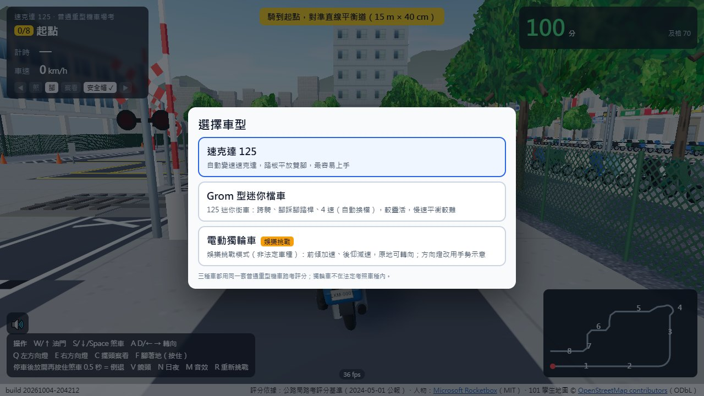

# 台灣機車考照 `moto-exam/`

在瀏覽器裡騎一趟台灣普通重型機車的路考。照官方場地圖的尺寸與 8 關順序蓋出考場，扣分項目照路考評分基準，滿分 100、70 分及格，扣 32 分的項目犯一次就不及格。考場放在用 OpenStreetMap 資料重建的台北 101 周邊街區裡。


## 怎麼開

這是 Vite 打包好的靜態網站（ES module ＋ `fetch` 載入人物模型），**不能直接雙擊 `index.html`**，要用任一個靜態伺服器：

```bash
cd moto-exam
python -m http.server 8000      # 或 npx serve .
# 開 http://localhost:8000/
```

或在 repo 設定開啟 GitHub Pages（Branch: `main`、資料夾 `/`），網址是 `https://<帳號>.github.io/Cc-web-toys/moto-exam/`。全部用相對路徑，放在任何子目錄都能跑。

## 玩法

開場先選車型：速克達 125、Grom 型迷你檔車（4 速、自動換檔），或娛樂挑戰用的電動獨輪車（非法定車種，方向燈改用手勢）。三種都用同一套評分。

| 鍵 | 功能 |
|---|---|
| W / ↑ | 油門 |
| S / ↓ / Space | 煞車；停車後放開再按住煞車 0.5 秒＝倒退 |
| A D / ← → | 轉向 |
| Q / E | 左／右方向燈 |
| C | 擺頭察看（停車再開、平交道要用） |
| F | 腳著地（按住） |
| V | 鏡頭　N 日夜　M 音效　R 重新挑戰 |

手機與平板會顯示觸控油門、煞車、方向盤和按鈕。

8 關依序是：直線平衡（15 m × 40 cm，至少 7 秒）、斑馬線禮讓行人、交岔路口號誌、二段式左轉、變換車道、直角轉彎、停車再開、平交道。畫面上的標線和判定用的是同一份資料，看到的線就是判定的線。



## 出處與授權

- **評分依據**：行政院公報第 030 卷第 080 期（2024-05-01）《普通重型及輕型機車駕駛人路考評分基準》，
  <https://gazette.nat.gov.tw/EG_FileManager/eguploadpub/eg030080/ch06/type2/gov50/num16/images/Eg01.pdf>。
  「前輪超過停止線」「停車察看」等判定細節是自行解讀，以實際考場與監理機關公告為準，本作品只供練習與娛樂。
- **地圖資料**：街道、建物高度、號誌、店名來自 © [OpenStreetMap contributors](https://www.openstreetmap.org/copyright)，以 [ODbL](https://opendatacommons.org/licenses/odbl/) 授權；資料已預先打包在 `assets/` 的 JS 裡，開頁不會向外部伺服器要資料。
- **人物模型**：[Microsoft Rocketbox](https://github.com/microsoft/Microsoft-Rocketbox)（MIT，授權全文見 `rocketbox/LICENSE-Rocketbox.md`）。`rocketbox/*.fbx.json` 是原始 FBX 以 base64 包成 JSON。
- **函式庫**：[three.js](https://threejs.org/)（MIT）、[fflate](https://github.com/101arrowz/fflate)（MIT），已打包在 `assets/`。
- 其餘程式碼、考場與 3D 物件依本 repo 的 MIT 授權。

頁尾左下角是 build 版本字串（`build 20261004-204212`）。
